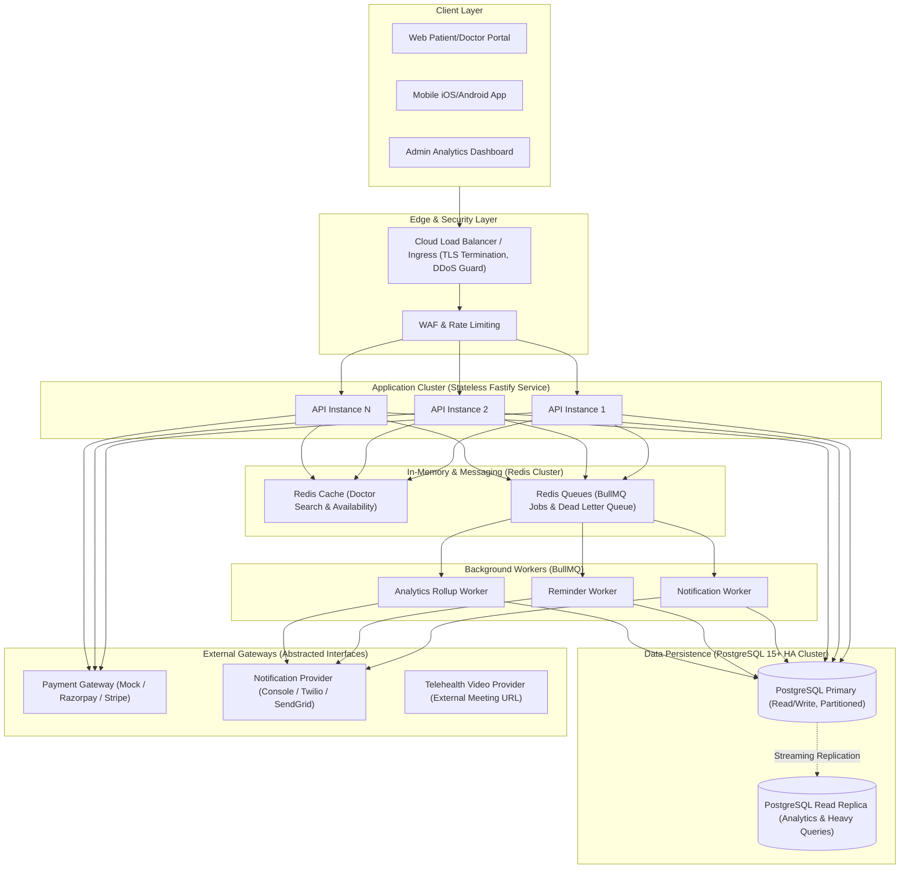
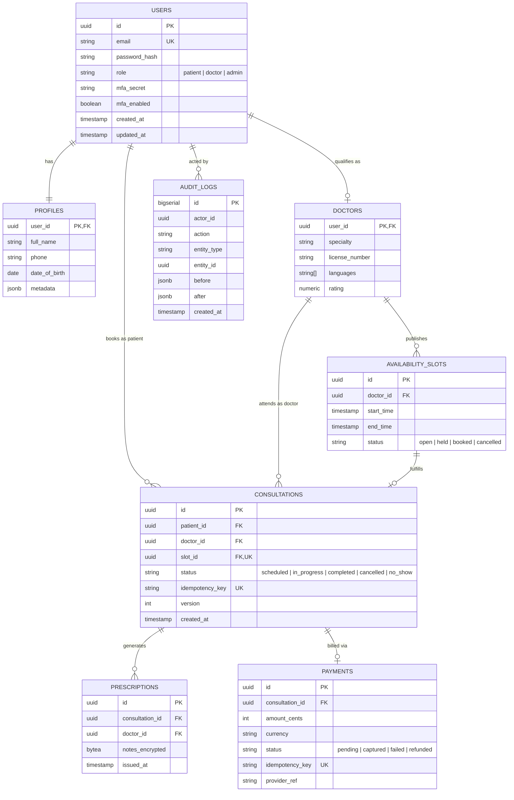
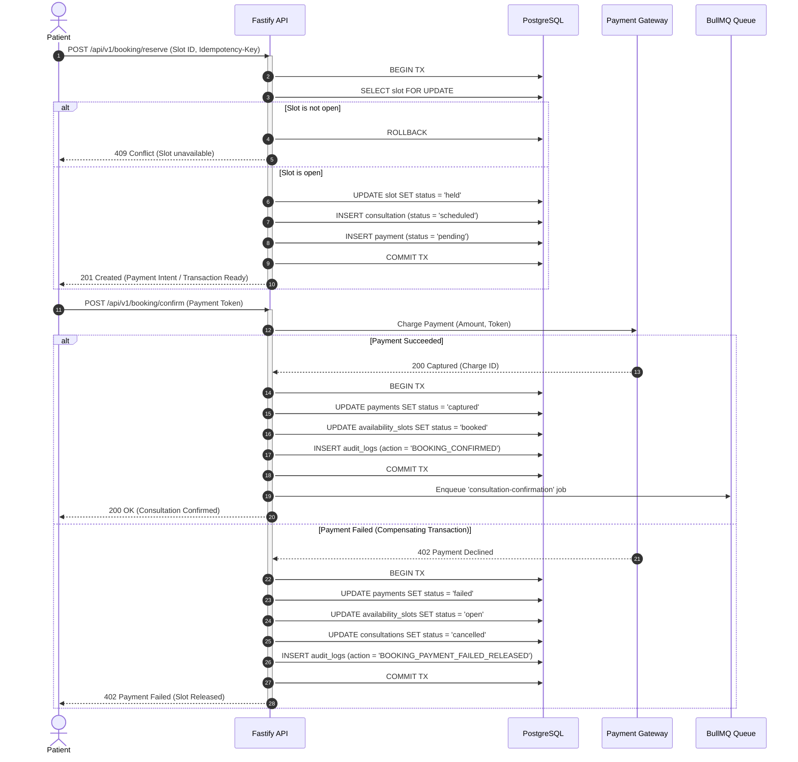
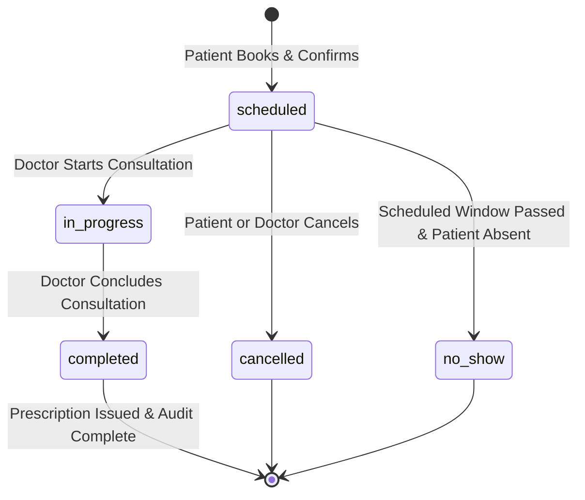
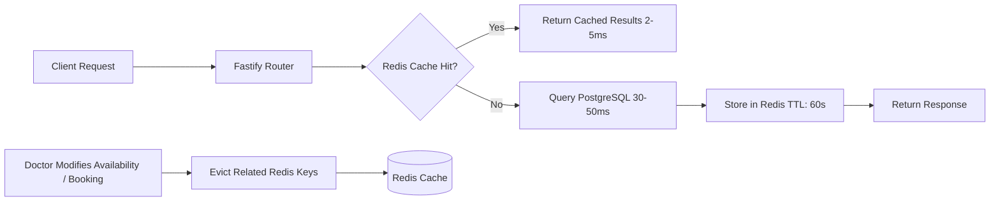

# Amrutam Telemedicine Backend — Architecture & System Design Document

## 1. Executive Summary & System Goals
The Amrutam Telemedicine Backend is an enterprise-grade, high-concurrency healthcare consultation platform designed to scale reliably toward **100,000 consultations per day** (~1.16 consultations/sec baseline, peak load 10–25 consultations/sec, and 200–500 read/search queries/sec) with **99.95% availability**.

In healthcare and telemedicine platforms, data correctness, non-repudiation, patient privacy (HIPAA/DISHA compliance), and zero double-booking are non-negotiable. This architecture implements:
- **Pessimistic Row-Level Locking (`SELECT FOR UPDATE`)** & unique database constraints to guarantee zero double-booking under concurrent load.
- **Strict Idempotency** on all mutating endpoints (`Idempotency-Key` headers) to eliminate duplicate charges and duplicate reservations.
- **Saga Orchestration Pattern** for booking and payments with automatic compensating transactions (releasing held slots if payment fails).
- **Partitioning & Caching Strategy** (PostgreSQL range partitioning by `created_at` on consultations, Redis cache-aside for doctor search and availability reads).
- **Immutable Audit Trails** (append-only `audit_logs` protected by database role privileges) and **AES-256-GCM field-level encryption** for clinical notes.
- **Comprehensive Observability** (Prometheus metrics, OpenTelemetry distributed tracing, structured correlation logging).

---

## 2. High-Level System Architecture



---

## 3. Core Domain Models & Database Design

### 3.1 Relational Schema & Constraints
The database schema enforces referential integrity, concurrency locks, and auditability at the storage engine level.



---

## 4. Concurrency Control & Zero Double-Booking Guarantee

### 4.1 The Race Condition Problem
When multiple patients attempt to book the same doctor's slot simultaneously (e.g., peak morning booking surges), naive `SELECT` followed by `UPDATE` allows two transactions to see the slot as `open`, leading to catastrophic double bookings.

### 4.2 Two-Tiered Prevention Strategy
1. **Tier 1 — Row-Level Pessimistic Locking (`SELECT FOR UPDATE`):**
   Within a PostgreSQL transaction, the booking engine issues:
   ```sql
   SELECT id, doctor_id, start_time, end_time, status
   FROM availability_slots
   WHERE id = $1
   FOR UPDATE;
   ```
   If Transaction B attempts to read the same slot with `FOR UPDATE`, it blocks until Transaction A commits or rolls back. Transaction B then reads the updated status (`booked`) and receives an immediate `409 Conflict: Slot already booked`.

2. **Tier 2 — Database Unique Constraint Guarantee:**
   A unique constraint on `consultations(slot_id)` and `availability_slots(doctor_id, start_time)` ensures that even under network partitioning or unexpected isolation levels, duplicate booking is physically rejected by the database engine.

---

## 5. Saga Workflow: Distributed Booking & Payment Orchestration

The booking and payment flow spans multiple entities: reserving the slot, processing payment, confirming the consultation, and notifying parties. We employ an **Orchestrated Saga Pattern** with forward execution and compensating rollback:



---

## 6. Consultation Lifecycle State Machine & Optimistic Locking

Consultations undergo strict state transitions verified by role authorization:



### Optimistic Locking with Versioning
To prevent race conditions during state transitions (e.g., patient cancelling while doctor starts consultation):
```sql
UPDATE consultations
SET status = $new_status, version = version + 1, updated_at = NOW()
WHERE id = $id AND version = $expected_version;
```
If 0 rows are affected, a `409 Conflict: Concurrent modification detected` is returned, forcing the client to re-fetch the latest consultation state.

---

## 7. PostgreSQL Partitioning Strategy (100k/day Scale)

At **100,000 consultations per day**, the `consultations` table accumulates **36.5 million rows annually**. Index maintenance, vacuuming, and sequential scans on unpartitioned tables degrade performance rapidly.

### Partitioning Scheme: Range Partitioning by `created_at`
The `consultations` table is partitioned monthly using PostgreSQL native declarative partitioning:

```sql
CREATE TABLE consultations (
  id UUID NOT NULL,
  patient_id UUID NOT NULL,
  doctor_id UUID NOT NULL,
  slot_id UUID NOT NULL,
  status TEXT NOT NULL,
  idempotency_key TEXT NOT NULL,
  version INT NOT NULL DEFAULT 1,
  created_at TIMESTAMPTZ NOT NULL DEFAULT now(),
  PRIMARY KEY (id, created_at)
) PARTITION BY RANGE (created_at);

-- Monthly partition tables created dynamically or ahead of time
CREATE TABLE consultations_y2026m09 PARTITION OF consultations
    FOR VALUES FROM ('2026-09-01 00:00:00+00') TO ('2026-10-01 00:00:00+00');

CREATE TABLE consultations_y2026m10 PARTITION OF consultations
    FOR VALUES FROM ('2026-10-01 00:00:00+00') TO ('2026-11-01 00:00:00+00');
```

### Benefits:
1. **Partition Pruning:** Queries bounded by date range scan only the active month's child partition, reducing buffer cache pressure by over 90%.
2. **Maintenance Isolation:** `VACUUM ANALYZE` runs efficiently per partition.
3. **Data Archival / Retention:** Partitions older than regulatory requirements (e.g., 7 years) can be detached and archived to cold S3 Parquet storage with zero downtime.

---

## 8. Caching Topology & Invalidation (Redis Cache-Aside)

Doctor search and availability are read-heavy (~95% read, ~5% write). A two-tier caching topology ensures sub-10ms response times:



- **Cache Keys:**
  - `doctor:search:<hash_of_query_params>` (TTL: 60s)
  - `doctor:slots:<doctor_id>:<date>` (TTL: 30s)
- **Targeted Invalidation:** Whenever a doctor adds a slot or a slot is booked/cancelled, the event triggers an invalidation hook targeting `doctor:slots:<doctor_id>:*` and general search cache tags.

---

## 9. Asynchronous Job Processing & Dead Letter Queues (BullMQ)

Heavy and out-of-band operations are decoupled from HTTP request cycles:
- **`notifications-queue`**: Sends SMS/email appointment confirmations and prescription alerts.
- **`reminders-queue`**: Scheduled delayed jobs triggering 15 minutes before consultation.
- **`analytics-rollup-queue`**: Computes hourly aggregate stats (consultations count, no-show rate, utilization) and writes to pre-aggregated tables to keep admin endpoints instantaneous.

**Reliability Controls:**
- Exponential backoff with jitter (`attempts: 5, backoff: { type: 'exponential', delay: 2000 }`).
- Dead Letter Queue (`DLQ`) for failed payloads after max retries for manual inspection and alerting.

---

## 10. Disaster Recovery (DR) & Business Continuity Plan

| Metric | Target | Strategy |
|---|---|---|
| **Recovery Point Objective (RPO)** | $\le 1 \text{ minute}$ | WAL archiving (pgBackRest / AWS WAL-G) to Amazon S3 every 60 seconds with continuous replication to standby. |
| **Recovery Time Objective (RTO)** | $\le 15 \text{ minutes}$ | Automated Patroni failover for PostgreSQL cluster; automated DNS failover (Route 53 latency routing). |
| **Data Retention** | 7 Years (HIPAA Compliance) | Detached annual table partitions archived to immutable AWS S3 Glacier with Object Lock. |

---

## 11. Infrastructure Mapping (Docker Compose to Kubernetes / ECS)

While the MVP runs cleanly locally via `docker-compose.yml`, the architecture maps directly to production cloud orchestrators:

- **Fastify API:** Deployed as Kubernetes `Deployment` (or AWS ECS Fargate Tasks) with Horizontal Pod Autoscaler (HPA) targeting 70% CPU / memory utilization.
- **Statelessness:** The API stores zero local state; session state resides in signed JWTs and Redis.
- **Ingress:** Kubernetes NGINX Ingress Controller / AWS ALB with TLS 1.3 termination, rate limiting, and WAF rules.
- **Background Workers:** Deployed as separate Kubernetes `Deployment` workers scaling on BullMQ queue depth metrics via KEDA (Kubernetes Event-driven Autoscaling).
- **PostgreSQL:** Managed AWS Aurora PostgreSQL Multi-AZ or Cloud SQL with automated storage scaling and read replicas.
- **Redis:** AWS ElastiCache for Redis Cluster with Multi-AZ automated failover.
