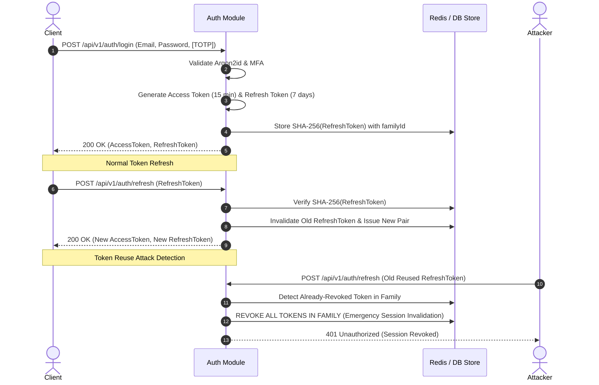

# Amrutam Telemedicine Backend — Security & Threat Model

## 1. Introduction & Compliance Scope
The Amrutam Telemedicine Backend handles Protected Health Information (PHI) and Personally Identifiable Information (PII). This platform is engineered in alignment with:
- **HIPAA Security Rule** (Technical Safeguards: Access Control §164.312(a), Audit Controls §164.312(b), Integrity §164.312(c), Transmission Security §164.312(e)).
- **DISHA (Digital Information Security in Healthcare Act) / NDHM standards**.
- **OWASP API Security Top 10 (2023)**.

---

## 2. STRIDE Threat Analysis & Mitigation Matrix

| Category | Threat Description | Attacker Objective | System Mitigation in Code |
|---|---|---|---|
| **S**poofing | Attacker impersonates a doctor or patient to access medical consultations or issue prescriptions. | Gain unauthorized medical access or steal prescription authority. | **TOTP MFA** (RFC 6238) for credential protection; **Argon2id** password hashing; cryptographically signed short-lived JWTs (15 min) with rotating refresh tokens (7 days). |
| **T**ampering | Malicious actor modifies appointment time, doctor diagnosis, or payment transaction amount. | Alter medical records or defraud payment gateway. | Cryptographic HMAC validation on webhooks; **AES-256-GCM authenticated encryption** on prescription notes; DB row versioning (`optimistic concurrency`). |
| **R**epudiation | A doctor denies issuing a prescription, or a patient denies booking an appointment. | Avoid legal accountability or billing obligations. | **Immutable Append-Only `audit_logs` table** capturing `actor_id`, `action`, `entity_id`, timestamp, and before/after JSON diffs. DB grants restrict app user from `UPDATE` or `DELETE` on audit logs. |
| **I**nformation Disclosure | Eavesdropping on consultation records, clinical notes, or token interception. | Harvest patient health history (PHI) and PII. | **Field-Level Encryption** (AES-256-GCM) on prescription notes; TLS 1.3 in transit; sensitive fields (passwords, MFA secrets, tokens) redacted from logs (`pino` redaction paths). |
| **D**enial of Service | High-frequency automated requests exhausting DB connection pools or slot bookings. | Take down service availability during peak clinic hours. | Token bucket rate limiting (100 req/min general, 10 req/min for auth); BullMQ queue backpressure; Fastify payload size limits (1MB max). |
| **E**levation of Privilege | A registered patient modifies user role to `doctor` or `admin` to view other patients' consultations. | Access restricted endpoints and medical data across tenants. | Strict **Role-Based Access Control (RBAC)** middleware on every route verifying claims against authenticated token payload; vertical and horizontal tenant isolation. |

---

## 3. Role-Based Access Control (RBAC) Matrix

| Resource / Action | Patient | Doctor | Admin | System / Cron |
|---|:---:|:---:|:---:|:---:|
| Register / Login / MFA Setup | Yes | Yes | Yes | — |
| Search Doctors & View Open Slots | Yes | Yes | Yes | — |
| Create / Update Availability Slots | No | Yes (Own slots only) | Yes | — |
| Reserve & Book Slot (Idempotent) | Yes | No | No | — |
| Cancel Scheduled Consultation | Yes (Own only) | Yes (Assigned only) | Yes | — |
| Start Consultation (`in_progress`) | No | Yes (Assigned only) | No | — |
| Complete Consultation (`completed`) | No | Yes (Assigned only) | No | — |
| Issue Prescription (AES-256-GCM) | No | Yes (Assigned only) | No | — |
| View Patient Prescription | Yes (Own only) | Yes (Assigned only) | No | — |
| View Platform Analytics Rollup | No | No | Yes | Yes |
| View Immutable Audit Logs | No | No | Yes (Read-Only) | — |

---

## 4. Cryptographic Standards & Key Management

### 4.1 Password Hashing (Argon2id)
All user passwords are encrypted using **Argon2id**, the winner of the Password Hashing Competition (PHC), providing state-of-the-art resistance against GPU-based cracking attacks.
- Algorithm: Argon2id
- Salt: 16 cryptographically secure random bytes
- Memory Cost: 65,536 KiB (64 MB)
- Time Cost: 3 iterations
- Parallelism: 4 threads

### 4.2 Field-Level PHI Encryption (AES-256-GCM)
Clinical prescription notes (`notes_encrypted`) contain sensitive diagnosis and medicine dosages. They are encrypted before persisting to PostgreSQL:
```
Encrypted Payload Format: [12-byte IV] + [16-byte Auth Tag] + [Ciphertext]
```
- **Cipher:** AES-256 in Galois/Counter Mode (GCM), providing authenticated encryption with associated data (AEAD).
- **Integrity Guarantee:** Any tampering with the ciphertext in storage is caught during decryption by auth tag verification.
- **Key Storage:** Injected strictly via environment variable (`ENCRYPTION_KEY`), rotated periodically via KMS in production.

### 4.3 Multi-Factor Authentication (TOTP - RFC 6238)
- Standard 6-digit TOTP tokens evaluated across a 30-second time window.
- Enrollment generates a base32 secret and standard `otpauth://` QR code.
- Verification requires two consecutive valid codes or single confirmation before `mfa_enabled` is set to `true`.

---

## 5. Token Architecture & Refresh Token Rotation



---

## 6. Database Level Security & Audit Log Immutability

To guarantee non-repudiation in malpractice or forensic disputes, the application connects using a restricted database user role:

```sql
-- Production Role Separation
CREATE ROLE amrutam_app_user WITH LOGIN PASSWORD 'strong_password';

-- Grant standard CRUD on operational tables
GRANT SELECT, INSERT, UPDATE, DELETE ON users, profiles, doctors, availability_slots, consultations, prescriptions, payments TO amrutam_app_user;

-- RESTRICT AUDIT LOGS TO APPEND-ONLY
GRANT SELECT, INSERT ON audit_logs TO amrutam_app_user;
-- Explicitly revoke destructive privileges
REVOKE UPDATE, DELETE, TRUNCATE ON audit_logs FROM amrutam_app_user;
```
Even if an attacker achieves Remote Code Execution (RCE) inside the API process, they **cannot delete or alter existing audit log history**.

---

## 7. Network & Defense-in-Depth Measures
- **Helmet Security Headers:** Strict CSP, HSTS (`max-age=31536000; includeSubDomains; preload`), `X-Frame-Options: DENY`, `X-Content-Type-Options: nosniff`.
- **CORS Policy:** Strict origin allowlist matching authorized telemedicine frontends.
- **Input Sanitization & Schema Validation:** Fastify JSON schema / Zod validation with `additionalProperties: false` preventing parameter pollution and prototype poisoning.
- **Log Masking & PII Redaction:** Pino configured with redaction rules for `password`, `mfa_secret`, `notes_encrypted`, `authorization`, and `cookie` fields.
